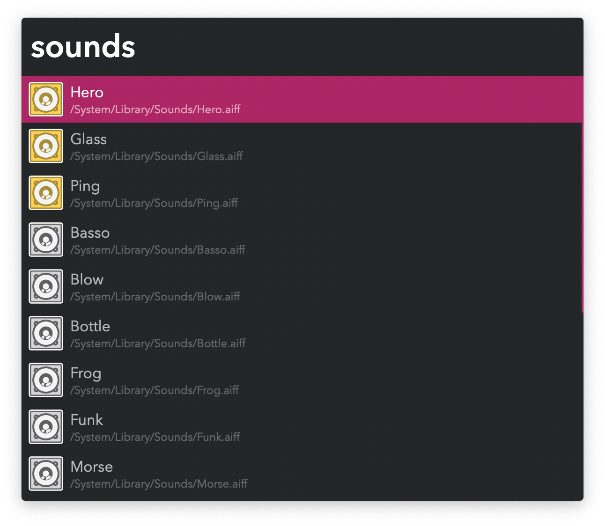

#  Library Sounds Alfred Workflow

Listen to and pick Library Sounds

[⤓ Install on the Alfred Gallery](https://alfred.app/workflows/vitor/library-sounds)

## Usage

Search sound files in `/System/Library/Sounds` and `~/Library/Sounds` via the `sounds` keyword.

* <kbd>↩&#xFE0E;</kbd> Play sound.
* <kbd>⌘</kbd><kbd>↩&#xFE0E;</kbd> Add or remove from favourites.

Favourites show up at the top of the list and can be manually ordered in the [Workflow’s Configuration](https://www.alfredapp.com/help/workflows/user-configuration/).
